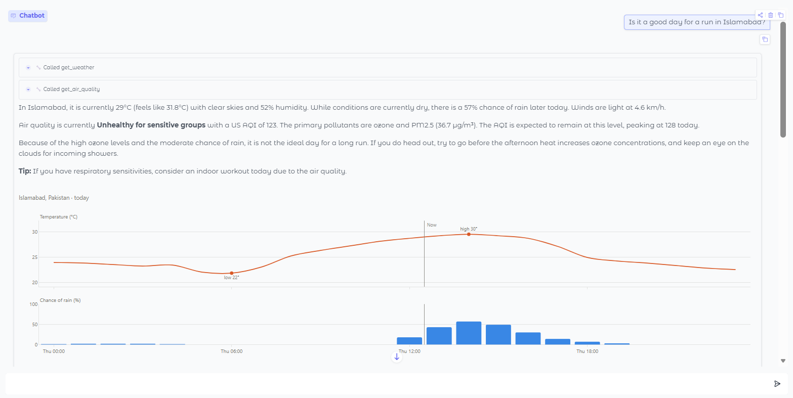
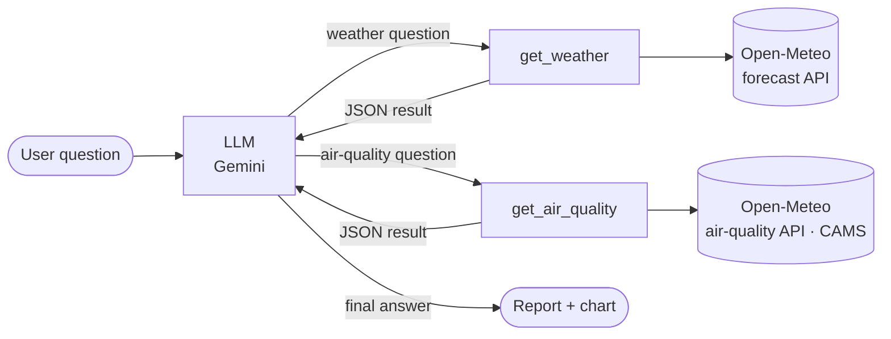

# 🌦️ Weather & Air Quality Agent: an AI agent built from scratch

An AI agent that answers weather and air-quality questions in plain language. A large
language model has two tools, a weather forecast and an air-quality forecast, and decides
on its own **which one to call** (one, both, or several times), with what arguments. It then
reads the data and writes a short report, and the interface draws an interactive chart.

I built the agent loop by hand, without an agent framework, to understand exactly how
tool calling works underneath libraries like LangGraph or smolagents.

 See the screenshot below or run it yourself in 5 minutes.



## What it can do

- **Chooses the right tool:** *"Will it rain in Karachi on Friday?"* → weather.
  *"How bad is the smog in Lahore?"* → air quality. *"Is it a good day for a run?"* → both.
- **Works out dates itself:** "Friday" or "10th October" becomes the right number of forecast days
- **Picks the right city** when names clash (`London, Canada` vs `London, UK`)
- **Calls tools several times in one turn** when needed (*"Compare Islamabad and Peshawar"*)
- **Draws interactive charts:** hourly temperature and chance of rain, or US AQI over the shaded
  official bands (Good → Hazardous)
- **Never invents data:** if a tool fails, the agent reports the problem instead of guessing
- **Shows every tool call** in collapsible panels, so you can watch the agent reason

## How it works



1. **Think:** the model receives the conversation plus a JSON description of both tools.
2. **Act:** it returns one or more tool calls, e.g. `get_air_quality(city="Lahore", days=2)`.
3. **Observe:** my code runs the functions and sends the results back to the model.
4. **Answer:** the loop repeats until the model replies in plain text; the interface then
   adds a chart for each tool that was used.

The whole loop is about 35 lines in `run_agent()` in [`weather_agent.py`](weather_agent.py).
The tool *descriptions* do most of the work in choosing between tools, so they say when
each tool should **and should not** be used.

## Tech stack

| Part | Tool |
|---|---|
| Language model | Google Gemini via its OpenAI-compatible API (free tier); Ollama also supported for running offline |
| Weather data | [Open-Meteo](https://open-meteo.com/) forecast and geocoding APIs (free, no key) |
| Air-quality data | [Open-Meteo Air Quality API](https://open-meteo.com/en/docs/air-quality-api), based on CAMS (Copernicus) |
| Interface and charts | [Gradio](https://www.gradio.app/) and [Plotly](https://plotly.com/python/) |
| Language | Python |

## Run it yourself

```bash
git clone https://github.com/Humaira-Muqades/weather-agent.git
cd weather-agent
python -m venv .venv
# Windows: .venv\Scripts\activate    macOS/Linux: source .venv/bin/activate
pip install -r requirements.txt
```

Create a file named `.env` in the project folder with a free key from
[Google AI Studio](https://aistudio.google.com/apikey):

```
GEMINI_API_KEY=your_key_here
MODEL=gemini-3-flash-preview
```

Google renames and retires models often. If the agent stops answering, run
`python find_model.py`: it tests several models and tells you which `MODEL` to use.

Then run either version:

```bash
python app.py            # web interface at http://127.0.0.1:7860
python weather_agent.py  # chat in the terminal
```

To run fully offline with [Ollama](https://ollama.com/) instead, set `PROVIDER=ollama` and
`MODEL=llama3.1:8b` in `.env`.

## Deploy it online (free)

The app is ready to deploy on [Render](https://render.com/)'s free plan, configured by
[`render.yaml`](render.yaml). To deploy your own copy: fork this repo, then in Render choose
**New → Blueprint**, connect the repo, and paste your `GEMINI_API_KEY` when asked.
Render installs `requirements.txt`, runs `python app.py`, and redeploys after every push.
Free services sleep after 15 minutes without visitors, so the first visit after a pause
takes about a minute to load.

## Project structure

```
weather_agent.py   the agent: both tools, their descriptions, the agent loop, terminal chat
app.py             web chat interface (Gradio): tool-call panels and charts
charts.py          interactive Plotly charts for weather and air quality
find_model.py      tests which Gemini models are currently answering
requirements.txt   Python dependencies (version ranges, so updates can't break the demo)
render.yaml        deployment settings for Render
.python-version    Python version used online
```

## What I learned

- **Tool calling is a loop, not magic.** The model only *requests* a function call; my code decides whether and how to run it.
- **Tool descriptions are the interface.** With two tools, the model picks between them using only their descriptions, so saying what each tool is *not* for matters as much as what it is for.
- **Models need context they can't know.** The agent couldn't answer "on Friday" reliably until I gave it today's date and labelled each forecast day.
- **Errors and timeouts must be handled.** Tool errors go back to the model as data, and every network call has a timeout, so a stuck request shows a clear message instead of a frozen app.
- **Models change under you.** One Gemini model started timing out and another was closed to new users, so the model name lives in config and `find_model.py` checks which ones work.
- **Real-world debugging:** Python requests failed while the browser worked. The cause was the network blocking normal DNS, which I fixed by enabling DNS over HTTPS in Windows.
- **Chart honestly.** Temperature and rain chance are separate panels rather than one chart with two y-axes, and AQI colours always come with a text label.
- **Keep secrets out of code.** The API key lives in `.env`, which `.gitignore` keeps off GitHub.


## Credits

Weather data by [Open-Meteo.com](https://open-meteo.com/), licensed under CC BY 4.0.
Air-quality data: Open-Meteo, based on CAMS (Copernicus Atmosphere Monitoring Service) forecasts.
